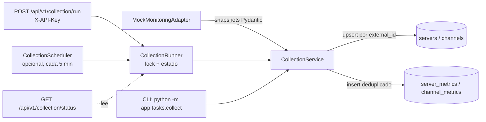
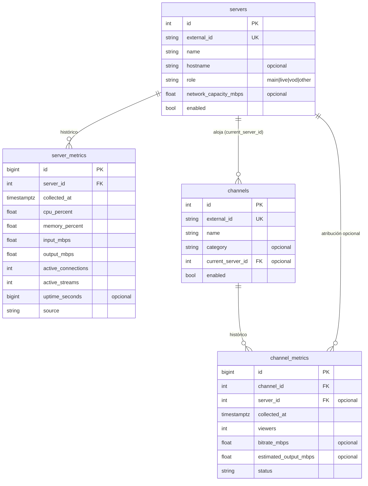
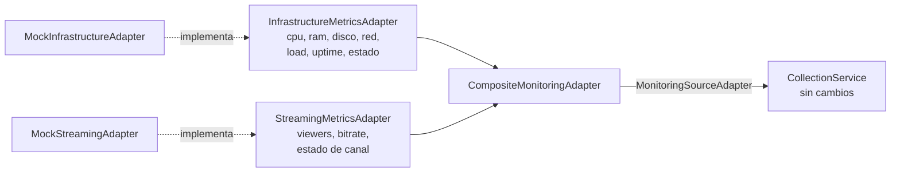

# Arquitectura de SuperFlash Monitor

Versión: 0.1.0 · Estado: solo lectura, datos simulados.

## Principio rector

La plataforma **observa, nunca actúa**. En esta fase no existe ningún
código capaz de modificar la infraestructura monitoreada: no hay SSH, no
hay ejecución remota, no hay escritura hacia paneles externos y no hay
movimientos de canales. Ver [¿Por qué solo lectura?](#por-qué-solo-lectura).

## Flujo de recolección

1. El adaptador entrega cuatro colecciones: servidores, canales,
   métricas de servidores y métricas de canales, como *snapshots*
   Pydantic ya validados.
2. `CollectionService` sincroniza el inventario: crea o actualiza
   servidores y canales usando `external_id` como clave natural.
3. Persiste una muestra de métricas con `collected_at` truncado al
   minuto. Si la muestra ya existe (`server/channel + collected_at`) se
   omite: repetir una recolección es idempotente.
4. Cada elemento se procesa dentro de un savepoint: un fallo puntual se
   registra en el log y en el resumen (`errors`), sin abortar el resto.
5. El resumen (`CollectionResult`) informa cuántos elementos se
   sincronizaron, insertaron, omitieron y qué errores hubo.

### Exclusión mutua y estado observable

Las recolecciones disparadas por HTTP, por CLI y por el scheduler pasan
por un único `CollectionRunner` por proceso (`app/collectors/runner.py`),
con exclusión mutua en dos niveles:

1. **Lock de hilo** no bloqueante: impide dos recolecciones en el mismo
   proceso (segunda petición HTTP → `409`; ciclo del scheduler que
   coincide → se omite con aviso en el log).
2. **Advisory lock de PostgreSQL** (`app/collectors/lock.py`,
   `pg_try_advisory_lock` con clave fija sobre una conexión dedicada):
   impide recolecciones simultáneas entre instancias distintas. Si el
   proceso muere, la conexión se cierra y PostgreSQL libera el lock
   automáticamente. Fuera de PostgreSQL (SQLite en tests) este nivel es
   un no-op y basta el lock de hilo.

El historial de ejecuciones se **persiste** en `collection_runs`: cada
pasada inserta su fila al empezar (estado `running`) y la completa al
terminar (fin, `duration_ms`, contadores, errores, origen
manual/scheduler). Durante la ejecución, el runner actualiza un
**heartbeat** persistido (`heartbeat_at`) entre fases.

`GET /api/v1/collection/status` lee de ahí y expone un contrato plano y
estable (`running`, `run_id`, `source`, `triggered_by`, `started_at`,
`heartbeat_at`, `finished_at`, `duration_ms`, `status`, `inserted`,
`skipped`, `errors`, `next_run_at`): sobrevive a reinicios y refleja
recolecciones de cualquier instancia. Una fila `running` cuenta como en
curso solo mientras su heartbeat no supere `COLLECTION_TIMEOUT_SECONDS`
(no una ventana fija): así una ejecución legítimamente larga sigue
apareciendo como activa, mientras que una interrumpida se detecta como
abandonada. Al iniciar una nueva pasada, las filas `running` con
heartbeat vencido se marcan como `error` (`mark_abandoned`).

### Snapshot compuesto por ciclo

`CompositeMonitoringAdapter` captura, al primer acceso de cada pasada,
un `CompositeCycleSnapshot` inmutable con las cuatro colecciones
(servidores, canales y ambas muestras). Cada fuente se consulta **una
sola vez por ciclo** y servidores y canales se derivan de la misma
muestra: consistencia temporal garantizada dentro de la pasada.
`CollectionService` marca el inicio de ciclo con
`begin_collection_cycle()` (no-op en los adaptadores sin cache).

### Programador periódico

`CollectionScheduler` (`app/tasks/scheduler.py`) es un bucle asyncio
dentro del proceso de la API, gestionado por el *lifespan* de FastAPI:

- Deshabilitado por defecto; se activa con `SCHEDULER_ENABLED=true`.
- Intervalo configurable con `COLLECTION_INTERVAL_SECONDS` (300 = cinco
  minutos, mínimo 5).
- La primera recolección ocurre un intervalo después del arranque.
- Un fallo de recolección se registra y el bucle continúa.
- Ejecuta la recolección en un hilo (`asyncio.to_thread`) para no
  bloquear el event loop de la API.

### Autenticación

Toda la API `/api/v1` exige la cabecera `X-API-Key`, comparada en tiempo
constante (`secrets.compare_digest`) contra `API_KEY` (alias histórico:
`COLLECTION_API_KEY`). La política es *fail-closed*: sin clave
configurada la API responde `503` en vez de quedar abierta. Solo
`/health` es público, para orquestadores y healthchecks. La clave existe
únicamente como variable de entorno; nunca se versiona ni se escribe en
logs.

### Retención y alertas

- **Retención** (`app/services/retention_service.py` +
  `python -m app.tasks.prune_metrics`): borra métricas y ejecuciones
  anteriores a `METRICS_RETENTION_DAYS` días. Deshabilitada por defecto;
  el comando se niega a operar sin configuración explícita y ofrece
  `--dry-run`. Solo toca la base propia de la plataforma.
- **Alertas** (`app/services/alert_service.py`, `GET /api/v1/alerts`):
  evaluación bajo demanda de la última muestra de cada servidor
  habilitado contra umbrales configurables (CPU, RAM, disco, utilización
  de red, obsolescencia de muestras). Sin persistencia ni notificaciones
  externas; los datos ausentes nunca generan falsas alertas.

## Responsabilidad de cada capa

| Capa | Módulo | Responsabilidad |
|------|--------|-----------------|
| Configuración | `app/core` | Settings tipados desde entorno/.env; logging |
| Dominio | `app/models` | Modelos ORM y enums (`ServerRole`, `ChannelStatus`) |
| Acceso a datos | `app/database`, `app/repositories` | Motor, sesiones y consultas |
| Adaptadores | `app/adapters` | Contrato con fuentes externas + mock |
| Recolección | `app/collectors` | Orquestación, lock de exclusión y estado |
| Servicios | `app/services` | Agregaciones de negocio (overview) |
| API HTTP | `app/api`, `app/schemas` | Endpoints, auth por API key y esquemas |
| Tareas | `app/tasks` | Comandos CLI y scheduler periódico opcional |

Las capas solo dependen "hacia abajo": la API usa servicios y
repositorios; los repositorios usan modelos; los adaptadores no conocen
la persistencia y la persistencia no conoce la fuente.

## Modelo de datos

Índices relevantes:

- `(server_id, collected_at)` y `(channel_id, collected_at)` compuestos,
  además de únicos → consultas históricas rápidas y deduplicación.
- `collected_at` individual → cortes globales por tiempo.
- `external_id` único → sincronización idempotente del inventario.

Los timestamps son siempre UTC (`TIMESTAMPTZ`). Los ids de métricas son
`BIGINT`: a una muestra cada 5 minutos el volumen crece de forma
sostenida y el esquema está dimensionado para años de histórico.

## Mecanismo de adaptadores

`MonitoringSourceAdapter` (en `app/adapters/base.py`) define el contrato
de solo lectura:

- `get_servers()` / `get_channels()`: inventario.
- `get_server_metrics()` / `get_channel_metrics()`: una muestra.

Las implementaciones devuelven modelos Pydantic (**snapshots**), no
modelos ORM: la validación ocurre en la frontera del sistema y la
persistencia queda desacoplada de la fuente.

`MockMonitoringAdapter` es la única implementación actual. Es
determinista: la misma semilla (`MOCK_SEED`) y el mismo minuto producen
la misma muestra, y los datos son coherentes entre sí (el output de un
servidor es la suma del output estimado de sus canales; CPU y memoria
crecen con la utilización de red).

## Fuentes múltiples: contratos por tipo

Las fuentes reales rara vez entregan todo junto: las métricas de máquina
suelen venir de un sistema (Prometheus, Netdata, API del proveedor) y
las de audiencia de otro (API del panel de streaming). Por eso existen
dos contratos separados en `app/adapters/sources.py`:

- `InfrastructureMetricsAdapter`: inventario de servidores +
  `InfrastructureMetricSnapshot` (CPU, RAM, disco, tráfico de entrada y
  salida, load average 1/5/15 min, uptime, estado del servidor).
- `StreamingMetricsAdapter`: inventario de canales +
  `StreamingChannelMetricSnapshot` (espectadores, bitrate estimado,
  estado del canal).
- `CompositeMonitoringAdapter` une ambas fuentes hacia el contrato
  histórico: las conexiones y streams por servidor se derivan de la
  muestra de streaming, y el output estimado por canal de
  `viewers × bitrate`. Se activa con `MONITORING_ADAPTER=composite`
  (el valor por defecto sigue siendo `mock`).

Los mocks de demostración (`MockInfrastructureAdapter`,
`MockStreamingAdapter`) envuelven `MockMonitoringAdapter` con la misma
semilla: describen el mismo mundo simulado sin duplicar lógica ni
cambiar el comportamiento del mock original. El esquema de base de datos
no cambia todavía: los campos nuevos (disco, load, estado del servidor)
viven solo en los snapshots hasta que una fuente real confirme qué
entrega, y entonces se incorporarán con una migración.

El comando `python -m app.tasks.diagnose_source` valida la configuración
y muestra qué datos entregaría cada fuente **sin escribir en la base de
datos**. Con `--infrastructure prometheus` comprueba conectividad, lista
las métricas disponibles por host y valida las consultas, ocultando
tokens.

### Fuente de infraestructura Prometheus (implementada)

`PrometheusInfrastructureAdapter` (`app/adapters/prometheus.py`) es la
primera fuente real. Consulta la API HTTP de Prometheus
(`GET /api/v1/query`, **solo GET**, sin comandos remotos) y normaliza las
métricas de node_exporter al `InfrastructureMetricSnapshot`. Los
servidores a monitorear vienen de un **inventario local no versionado**
(`app/adapters/inventory.py`), del que el repositorio solo incluye
`config/inventory.example.yaml`.

Rasgos de diseño:

- **Solo lectura y sin fabricar datos**: un host con `up == 0` o sin
  métricas esenciales no emite muestra; un host que falla se omite sin
  bloquear a los demás; si fallan todos, la pasada queda en `error`.
- **Seguridad**: URL, token, TLS y timeout llegan solo por configuración;
  el token nunca se loguea; la verificación TLS no puede desactivarse en
  producción (validado en `Settings`); `node_exporter_instance` se valida
  contra inyección de PromQL.
- **Composición**: con `MONITORING_ADAPTER=composite` +
  `INFRASTRUCTURE_SOURCE=prometheus`, la infraestructura real se combina
  con la fuente de streaming (aún mock) sin tocar el recolector.

El detalle (variables, consultas PromQL, Netdata como alternativa) está
en `docs/real-source-integration.md`.

## Cómo se añadirá la próxima fuente real

El proceso completo está en `docs/real-source-integration.md`. En corto:

1. Declarar las variables de entorno de la fuente en `Settings` (nunca
   credenciales en el código; la API no acepta URLs arbitrarias).
2. Implementar `InfrastructureMetricsAdapter` o
   `StreamingMetricsAdapter` en `app/adapters/<fuente>.py` (el adaptador
   Prometheus sirve de plantilla para otra fuente de infraestructura).
3. Registrar el identificador en `factory.py` y en los `Literal` de
   `Settings` (`INFRASTRUCTURE_SOURCE` / `STREAMING_SOURCE`).
4. Validar con `diagnose_source`, probar con respuestas grabadas, correr
   en sombra con `MONITORING_ADAPTER=composite` y solo entonces
   promoverla. El recolector, los repositorios y la API no cambian.

## Preparación para recomendaciones futuras

La fase de recomendaciones se apoyará en lo ya construido:

- El histórico por servidor y canal permite calcular percentiles de
  carga, horas pico y tendencias de audiencia.
- `network_capacity_mbps` + `estimated_output_mbps` permiten simular
  "¿qué pasaría si el canal X se moviera al servidor Y?" sin tocar nada.
- El diseño previsto es un servicio de dominio (p. ej.
  `services/recommendation_service.py`) que produzca **sugerencias
  persistidas y consultables**, nunca acciones: aplicar un cambio
  seguirá siendo una decisión humana fuera de esta plataforma.

## ¿Por qué solo lectura?

- **Seguridad operativa**: un error en un sistema que actúa puede
  degradar el servicio real; un error en un sistema que observa solo
  produce datos incorrectos.
- **Confianza progresiva**: antes de automatizar nada hace falta
  histórico suficiente para validar que las métricas y los cálculos de
  utilización reflejan la realidad.
- **Simplicidad**: sin credenciales de escritura, la superficie de
  ataque y el impacto de un compromiso son mínimos.
- **Reversibilidad**: esta fase no deja ningún estado en la
  infraestructura externa; se puede desplegar y retirar sin riesgo.
