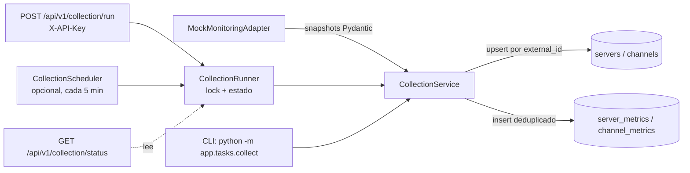
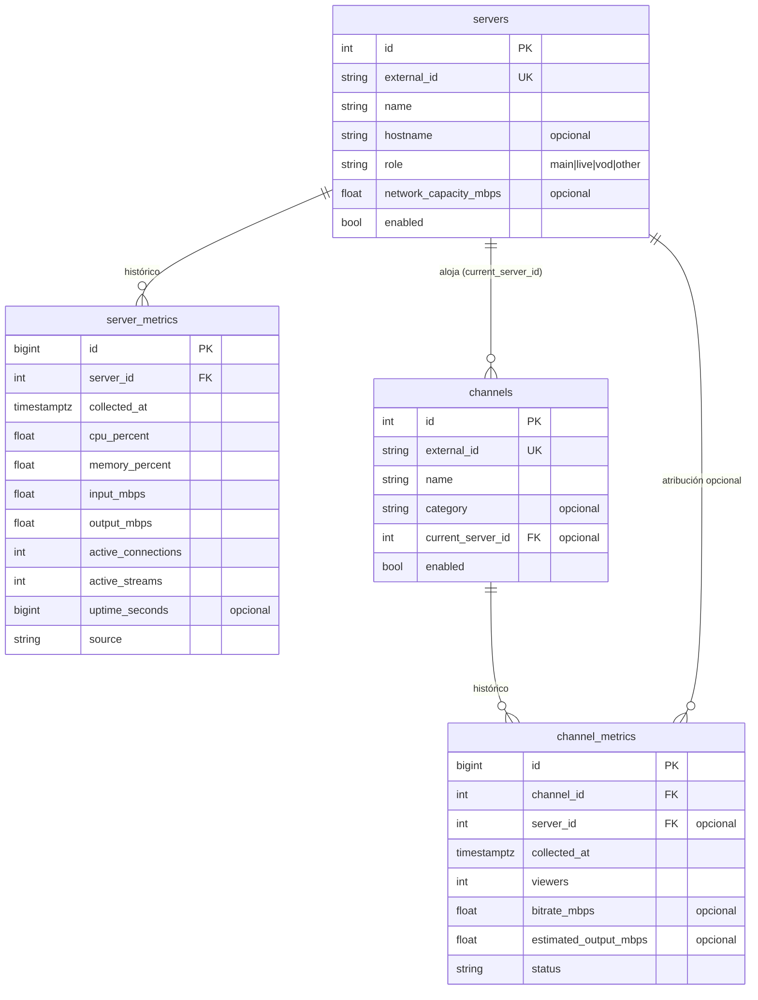

# Arquitectura de SuperFlash Monitor

Versión: 0.1.0 · Estado: solo lectura, datos simulados.

## Principio rector

La plataforma **observa, nunca actúa**. En esta fase no existe ningún
código capaz de modificar la infraestructura monitoreada: no hay SSH, no
hay ejecución remota, no hay escritura hacia paneles externos y no hay
movimientos de canales. Ver [¿Por qué solo lectura?](#por-qué-solo-lectura).

## Flujo de recolección

1. El adaptador entrega cuatro colecciones: servidores, canales,
   métricas de servidores y métricas de canales, como *snapshots*
   Pydantic ya validados.
2. `CollectionService` sincroniza el inventario: crea o actualiza
   servidores y canales usando `external_id` como clave natural.
3. Persiste una muestra de métricas con `collected_at` truncado al
   minuto. Si la muestra ya existe (`server/channel + collected_at`) se
   omite: repetir una recolección es idempotente.
4. Cada elemento se procesa dentro de un savepoint: un fallo puntual se
   registra en el log y en el resumen (`errors`), sin abortar el resto.
5. El resumen (`CollectionResult`) informa cuántos elementos se
   sincronizaron, insertaron, omitieron y qué errores hubo.

### Exclusión mutua y estado observable

Las recolecciones disparadas por HTTP y por el scheduler pasan por un
único `CollectionRunner` por proceso (`app/collectors/runner.py`):

- Un lock no bloqueante garantiza que **nunca** corren dos recolecciones
  a la vez: la segunda petición HTTP recibe `409` y el ciclo del
  scheduler que coincide con una ejecución manual se omite con un aviso
  en el log.
- El runner registra la última ejecución (inicio, fin, duración,
  resultado o error), que `GET /api/v1/collection/status` expone junto
  con el estado del scheduler (`enabled`, `interval_seconds`,
  `next_run_at`).

Este lock y este estado viven en memoria del proceso: son correctos para
un despliegue de una sola instancia (el actual). Para réplicas múltiples
el plan es sustituirlos por un lock a nivel de PostgreSQL
(`pg_advisory_lock`) y persistir el historial de ejecuciones.

### Programador periódico

`CollectionScheduler` (`app/tasks/scheduler.py`) es un bucle asyncio
dentro del proceso de la API, gestionado por el *lifespan* de FastAPI:

- Deshabilitado por defecto; se activa con `SCHEDULER_ENABLED=true`.
- Intervalo configurable con `COLLECTION_INTERVAL_SECONDS` (300 = cinco
  minutos, mínimo 5).
- La primera recolección ocurre un intervalo después del arranque.
- Un fallo de recolección se registra y el bucle continúa.
- Ejecuta la recolección en un hilo (`asyncio.to_thread`) para no
  bloquear el event loop de la API.

### Autenticación del endpoint interno

`POST /api/v1/collection/run` exige la cabecera `X-API-Key` comparada en
tiempo constante (`secrets.compare_digest`) contra `COLLECTION_API_KEY`.
La política es *fail-closed*: sin clave configurada el endpoint responde
`503` en vez de quedar abierto. La clave solo existe como variable de
entorno; nunca se versiona ni se escribe en logs. Los endpoints GET de
consulta permanecen abiertos por diseño (despliegue en red privada).

## Responsabilidad de cada capa

| Capa | Módulo | Responsabilidad |
|------|--------|-----------------|
| Configuración | `app/core` | Settings tipados desde entorno/.env; logging |
| Dominio | `app/models` | Modelos ORM y enums (`ServerRole`, `ChannelStatus`) |
| Acceso a datos | `app/database`, `app/repositories` | Motor, sesiones y consultas |
| Adaptadores | `app/adapters` | Contrato con fuentes externas + mock |
| Recolección | `app/collectors` | Orquestación, lock de exclusión y estado |
| Servicios | `app/services` | Agregaciones de negocio (overview) |
| API HTTP | `app/api`, `app/schemas` | Endpoints, auth por API key y esquemas |
| Tareas | `app/tasks` | Comandos CLI y scheduler periódico opcional |

Las capas solo dependen "hacia abajo": la API usa servicios y
repositorios; los repositorios usan modelos; los adaptadores no conocen
la persistencia y la persistencia no conoce la fuente.

## Modelo de datos

Índices relevantes:

- `(server_id, collected_at)` y `(channel_id, collected_at)` compuestos,
  además de únicos → consultas históricas rápidas y deduplicación.
- `collected_at` individual → cortes globales por tiempo.
- `external_id` único → sincronización idempotente del inventario.

Los timestamps son siempre UTC (`TIMESTAMPTZ`). Los ids de métricas son
`BIGINT`: a una muestra cada 5 minutos el volumen crece de forma
sostenida y el esquema está dimensionado para años de histórico.

## Mecanismo de adaptadores

`MonitoringSourceAdapter` (en `app/adapters/base.py`) define el contrato
de solo lectura:

- `get_servers()` / `get_channels()`: inventario.
- `get_server_metrics()` / `get_channel_metrics()`: una muestra.

Las implementaciones devuelven modelos Pydantic (**snapshots**), no
modelos ORM: la validación ocurre en la frontera del sistema y la
persistencia queda desacoplada de la fuente.

`MockMonitoringAdapter` es la única implementación actual. Es
determinista: la misma semilla (`MOCK_SEED`) y el mismo minuto producen
la misma muestra, y los datos son coherentes entre sí (el output de un
servidor es la suma del output estimado de sus canales; CPU y memoria
crecen con la utilización de red).

## Cómo se añadirá la fuente real

1. Nuevo módulo `app/adapters/panel.py` (nombre orientativo) que
   implemente `MonitoringSourceAdapter` consumiendo la API del panel
   real **en modo lectura**.
2. Sus credenciales y URL llegarán por variables de entorno
   (`PANEL_API_URL`, `PANEL_API_TOKEN`, …) declaradas en `Settings`;
   nunca en el código ni en logs. La API pública de esta plataforma no
   aceptará URLs arbitrarias: el destino se fija por configuración.
3. Registro en `app/adapters/factory.py` bajo un nuevo valor de
   `MONITORING_ADAPTER` (p. ej. `panel`).
4. Nada más cambia: recolector, repositorios, API y tests de dominio son
   agnósticos a la fuente. Se añadirán tests específicos del adaptador
   con respuestas grabadas/mockeadas.

## Preparación para recomendaciones futuras

La fase de recomendaciones se apoyará en lo ya construido:

- El histórico por servidor y canal permite calcular percentiles de
  carga, horas pico y tendencias de audiencia.
- `network_capacity_mbps` + `estimated_output_mbps` permiten simular
  "¿qué pasaría si el canal X se moviera al servidor Y?" sin tocar nada.
- El diseño previsto es un servicio de dominio (p. ej.
  `services/recommendation_service.py`) que produzca **sugerencias
  persistidas y consultables**, nunca acciones: aplicar un cambio
  seguirá siendo una decisión humana fuera de esta plataforma.

## ¿Por qué solo lectura?

- **Seguridad operativa**: un error en un sistema que actúa puede
  degradar el servicio real; un error en un sistema que observa solo
  produce datos incorrectos.
- **Confianza progresiva**: antes de automatizar nada hace falta
  histórico suficiente para validar que las métricas y los cálculos de
  utilización reflejan la realidad.
- **Simplicidad**: sin credenciales de escritura, la superficie de
  ataque y el impacto de un compromiso son mínimos.
- **Reversibilidad**: esta fase no deja ningún estado en la
  infraestructura externa; se puede desplegar y retirar sin riesgo.
