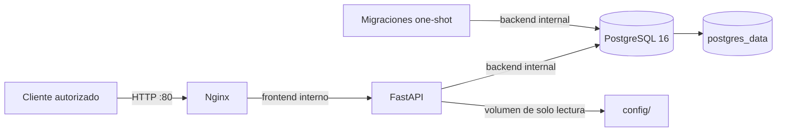

# Despliegue en producción

Esta guía prepara SuperFlash Monitor para un primer despliegue en un único
host Ubuntu 24.04 con Docker Compose. La aplicación continúa en modo de solo
lectura y usa el adaptador `mock`; no se conectan servidores reales.

El despliegue no instala Prometheus, Grafana, Redis, Certbot ni Watchtower.
HTTPS queda preparado en Nginx, pero la emisión y renovación de certificados
se mantienen fuera de esta fase.

## Topología



| Servicio | Imagen | Exposición | Persistencia |
|---|---|---|---|
| `nginx` | `nginx:1.27-alpine` | Único puerto del host: `${HTTP_PORT}:80` | No |
| `api` | Build local desde `Dockerfile` | Solo `expose: 8000` dentro de Docker | No |
| `db` | `postgres:16-alpine` | Sin puerto publicado | Volumen `postgres_data` |
| `migrations` | Build local desde `Dockerfile` | One-shot, sin puerto | No |

La red `backend` está marcada como `internal: true` y solo conecta API,
migraciones y PostgreSQL. La red `frontend` conecta Nginx con API, pero API
no publica ningún puerto al host.

El scheduler vive dentro del proceso de API. Por eso la configuración de
producción usa una sola instancia de API; no se debe escalar `api` mientras
`SCHEDULER_ENABLED=true`.

## Requisitos del host

- Ubuntu Server 24.04 LTS de 64 bits.
- Acceso SSH con una cuenta administrativa y `sudo`.
- DNS apuntando al host si se expondrá fuera de la red local.
- Al menos el puerto HTTP configurado en `HTTP_PORT`; no publicar PostgreSQL.
- Espacio suficiente para el volumen de PostgreSQL y copias de seguridad
  externas al volumen.

Docker advierte que los puertos publicados pueden bypassar reglas de UFW o
firewalld. Revisa la cadena `DOCKER-USER` y aplica la política de firewall
antes de exponer el servicio.

## Instalar Docker Engine y Compose

Usa el repositorio APT oficial de Docker. El paquete
`docker-compose-plugin` instala el comando moderno `docker compose`; no se
requiere el binario legado `docker-compose`.

```bash
sudo apt-get update
sudo apt-get install -y ca-certificates curl
sudo install -m 0755 -d /etc/apt/keyrings
sudo curl -fsSL https://download.docker.com/linux/ubuntu/gpg \
  -o /etc/apt/keyrings/docker.asc
sudo chmod a+r /etc/apt/keyrings/docker.asc

sudo tee /etc/apt/sources.list.d/docker.sources <<EOF
Types: deb
URIs: https://download.docker.com/linux/ubuntu
Suites: $(. /etc/os-release && echo "${UBUNTU_CODENAME:-$VERSION_CODENAME}")
Components: stable
Architectures: $(dpkg --print-architecture)
Signed-By: /etc/apt/keyrings/docker.asc
EOF

sudo apt-get update
sudo apt-get install -y docker-ce docker-ce-cli containerd.io \
  docker-buildx-plugin docker-compose-plugin

sudo systemctl enable --now docker
sudo docker run hello-world
docker compose version
```

Antes de desplegar, confirma que el VPS expone el subcomando moderno
`docker compose` y conserva el resultado para la revisión del release:

```bash
docker compose version
docker compose --env-file .env.production -f docker-compose.prod.yml config
```

El compose usa `depends_on.condition: service_completed_successfully` para
mantener las migraciones como job one-shot y el secreto Compose
`secrets.*.environment` para montar `API_KEY` únicamente en Nginx. Ambas
capacidades deben estar disponibles en el plugin Compose del VPS; no se debe
reemplazar `docker compose` por el binario legado `docker-compose`.

Para usar Docker sin `sudo`, añade el usuario de despliegue al grupo Docker y
abre una nueva sesión SSH:

```bash
sudo usermod -aG docker "$USER"
```

El grupo Docker concede privilegios equivalentes a root. Si eso no es
aceptable, usa Docker rootless según la política de seguridad del host.

## Preparar el checkout

Usa una revisión concreta (tag o commit) para que el despliegue sea
reproducible:

```bash
git clone https://github.com/MiguelTroncoso/superflash_ia.git
cd superflash_ia
git checkout <release-ref>
cp .env.production.example .env.production
chmod 600 .env.production
```

Genera valores nuevos y escríbelos únicamente en `.env.production`:

```bash
openssl rand -hex 32
python3 -c "import secrets; print(secrets.token_urlsafe(32))"
```

Usa el primer valor para `POSTGRES_PASSWORD` y el segundo para `API_KEY`.
El password hexadecimal evita caracteres que deban escaparse en la URL de
conexión interna. No uses los textos `REPLACE_WITH_...` en un host real.

La configuración inicial mantiene:

- `MONITORING_ADAPTER=mock`.
- `INFRASTRUCTURE_SOURCE=mock` y `STREAMING_SOURCE=mock`.
- `SCHEDULER_ENABLED=true` con una sola instancia API.
- `CORS_ORIGINS` vacío.
- `PROMETHEUS_BEARER_TOKEN` vacío y sin inventario real.

## Despliegue inicial

El script valida el compose, construye API/migraciones, espera el healthcheck
de PostgreSQL, aplica `alembic upgrade head` y luego arranca API y Nginx:

```bash
./scripts/deploy.sh
```

El script usa `.env.production` y `docker-compose.prod.yml` por defecto. Se
pueden sobrescribir ambas rutas sin editar el repositorio:

```bash
ENV_FILE=/ruta/.env.production \
COMPOSE_FILE=/ruta/docker-compose.prod.yml \
./scripts/deploy.sh
```

No uses `docker compose down -v`: eliminaría el volumen persistente de
PostgreSQL.

## Migraciones

Las migraciones no se ejecutan al importar la aplicación. El flujo explícito
es:

```bash
docker compose --env-file .env.production \
  -f docker-compose.prod.yml run --rm --no-deps migrations
```

`scripts/deploy.sh` ya ejecuta este comando después de comprobar que la base
está saludable. En una actualización, revisa primero las migraciones del
release y conserva un backup antes de aplicarlas.

## Validaciones posteriores

Ejecuta estas comprobaciones en cada despliegue:

```bash
docker compose --env-file .env.production \
  -f docker-compose.prod.yml ps

curl --fail --silent --show-error http://127.0.0.1/health
```

La respuesta esperada de `/health` incluye `status: "ok"` y
`database: "ok"`. Valida también que solo Nginx tenga un puerto publicado:

```bash
docker compose --env-file .env.production \
  -f docker-compose.prod.yml port nginx 80

docker compose --env-file .env.production \
  -f docker-compose.prod.yml port api 8000

docker compose --env-file .env.production \
  -f docker-compose.prod.yml port db 5432
```

El primer comando debe mostrar el binding configurado. Los dos últimos deben
indicar que no existe un puerto publicado. Comprueba además los logs ante
cualquier healthcheck fallido:

```bash
docker compose --env-file .env.production \
  -f docker-compose.prod.yml logs --tail=100 api nginx db
```

Los endpoints `/api/v1` requieren `X-API-Key`; no registres esa clave en
shell history ni la pegues en tickets o logs.

## Backups

El backup usa formato custom de `pg_dump`, no depende de una instalación de
PostgreSQL en el host y se escribe con permisos `600`:

```bash
./scripts/backup_postgres.sh
```

Para indicar una ruta:

```bash
./scripts/backup_postgres.sh /var/backups/superflash/superflash_20260723T120000Z.dump
```

Recomendaciones operativas:

1. Ejecuta el backup antes de cada actualización o migración.
2. Copia el archivo a almacenamiento externo con control de acceso.
3. Conserva varias generaciones y una copia fuera del host.
4. Prueba periódicamente una restauración en un entorno aislado.
5. No guardes backups en el repositorio ni en el volumen de la aplicación.

Este proyecto no instala todavía un timer de backup. La frecuencia debe
quedar definida por la política operativa del host.

## Restauración

La restauración reemplaza objetos de la base actual. Requiere una confirmación
explícita, detiene API/Nginx, valida el archivo, ejecuta `pg_restore`, aplica
migraciones pendientes y vuelve a arrancar los servicios:

```bash
CONFIRM_RESTORE=YES ./scripts/restore_postgres.sh \
  /var/backups/superflash/superflash_20260723T120000Z.dump
```

Después ejecuta las validaciones de `/health`, `docker compose ps` y logs. Si
el restore falla, conserva el backup original y revisa el log de PostgreSQL
antes de realizar otra operación.

## Actualización

```bash
./scripts/backup_postgres.sh
git fetch --tags origin
git checkout <new-release-ref>
./scripts/deploy.sh
curl --fail --silent --show-error http://127.0.0.1/health
```

El script reconstruye las imágenes locales, aplica migraciones y recrea los
servicios necesarios. No uses `latest` como referencia de código; las
versiones de imagen de PostgreSQL y Nginx sí deben actualizarse de forma
deliberada y validarse en staging.

## Rollback

El rollback de aplicación consiste en volver al release anterior y ejecutar
el mismo flujo:

```bash
git checkout <previous-release-ref>
./scripts/deploy.sh
```

Esto no revierte automáticamente una migración ya aplicada. Si la migración
del release nuevo no es compatible con el código anterior, detén la operación
y restaura el backup tomado antes de actualizar:

```bash
CONFIRM_RESTORE=YES ./scripts/restore_postgres.sh \
  /var/backups/superflash/pre-update.dump
git checkout <previous-release-ref>
./scripts/deploy.sh
```

No ejecutes `alembic downgrade` en producción como mecanismo automático de
rollback: primero valida la estrategia y conserva una copia recuperable.

## HTTPS preparado

La stack inicial publica HTTP para no introducir Certbot ni emisión
automática. La plantilla `nginx/conf.d/https.conf.example` contiene un
servidor TLS con TLS 1.2/1.3, headers proxy y los mismos límites del API.

Cuando exista un certificado administrado por un proceso externo:

1. Monta los certificados como solo lectura en `/etc/nginx/certs`.
2. Copia la plantilla a `nginx/conf.d/https.conf`.
3. Publica `443:443` en el servicio `nginx` y monta el directorio de
   certificados en `docker-compose.prod.yml`.
4. Cambia `server_name` por el dominio administrado.
5. Agrega el redirect HTTP → HTTPS en `default.conf`.
6. Recrea Nginx y valida el certificado desde una red externa.

No habilites el archivo TLS antes de que existan ambos paths de certificado.

## Fuera de alcance

Esta preparación no agrega Prometheus, Grafana, Redis, Certbot, Watchtower,
alertas externas, IA ni conexión con servidores reales. Tampoco cambia la
lógica de dominio, modelos, migraciones existentes, scheduler, adaptadores ni
endpoints.

## Referencias oficiales

- [Instalar Docker Engine en Ubuntu](https://docs.docker.com/engine/install/ubuntu/).
- [Instalar el plugin Docker Compose en Linux](https://docs.docker.com/compose/install/linux/).
